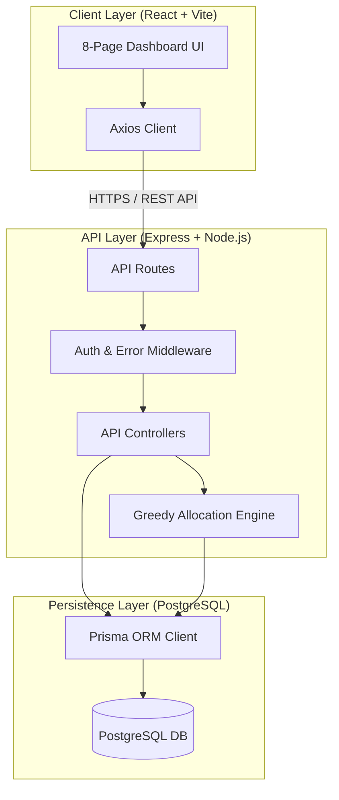

# 🌊 PeerFlow – Peer Review Allocation System
## Detailed Project Working Report
**Date:** June 5, 2026 | **Internship context:** Xebia Internship | **Created by:** Team Code Fixers

---

## 📌 Executive Summary
PeerFlow is a premium, enterprise-ready full-stack application designed to automate the assignment of student peer reviews for university-level coursework. The system solves the complex problem of distributing peer reviews fairly while satisfying multiple conflicting rules (constraints), such as avoiding self-grading, ensuring team members do not grade each other, and avoiding assigning the same reviewer pairs repeatedly.

---

## 👥 Team & Roles
* **Sambhav (Backend Developer)**: Implemented the Express API, route handling, JWT verification, role-based guard middleware, and global error handlers.
* **Priyansh (Database Architect)**: Designed the relational schema in PostgreSQL, configured Prisma models, and managed the database migration and unique constraints.
* **Aastha (Algorithm Engineer)**: Authored the greedy constraint-first allocation design and documented the mathematical/logic constraints.
* **Muskan (QA Engineer)**: Developed the unit test coverage using Jest and verified constraints using custom mock test suites.
* **Atharv (Frontend Developer)**: Built the 8-page React + Vite dashboard utilizing Vanilla CSS variables and Recharts analytics.

---

## ⚙️ System Architecture

PeerFlow is built on a decoupled full-stack architecture:



---

## 🗄️ Database Design (Prisma)

The persistence layer uses a 6-model PostgreSQL database schema managed via **Prisma ORM**. Below is the entity relation structure and the purpose of each table:

### 1. `User`
* **Purpose**: Manages system authentication credentials.
* **Key Fields**:
  * `id` (UUID, Primary Key)
  * `email` (String, Unique)
  * `passwordHash` (String)
  * `role` (Enum: `INSTRUCTOR` | `STUDENT`)
* **Relationships**: Has a one-to-one relationship with `Student` (if role is `STUDENT`).

### 2. `Team`
* **Purpose**: Groups students together to enforce team-related constraints.
* **Key Fields**:
  * `id` (UUID, Primary Key)
  * `name` (String)
  * `assignmentId` (String)
* **Relationships**: Has a one-to-many relationship with `Student`.

### 3. `Student`
* **Purpose**: Represents course participants, tracking their active status and current review workload.
* **Key Fields**:
  * `id` (UUID, Primary Key)
  * `name` (String)
  * `email` (String, Unique)
  * `status` (Enum: `ACTIVE` | `INACTIVE` | `DROPPED`)
  * `reviewCount` (Int, default: 0) — tracks the number of reviews currently assigned (used for workload balancing).
* **Relationships**: Belongs to a `Team` and optionally links to a `User` account.

### 4. `Submission`
* **Purpose**: Records files/assignments submitted by students that require grading.
* **Key Fields**:
  * `id` (UUID, Primary Key)
  * `assignmentId` (String)
  * `ownerId` (UUID, Foreign Key → Student)
  * `status` (Enum: `PENDING` | `UNDER_REVIEW` | `COMPLETE`)
  * `reviewCount` (Int, default: 0) — tracks how many reviews have been allocated.
* **Relationships**: Linked to `Student` (owner) and has many `ReviewTask` records.

### 5. `ReviewTask`
* **Purpose**: A junction table mapping an assigned reviewer to a target student's submission.
* **Key Fields**:
  * `id` (UUID, Primary Key)
  * `submissionId` (UUID, Foreign Key)
  * `reviewerId` (UUID, Foreign Key → Student)
  * `status` (Enum: `PENDING` | `IN_PROGRESS` | `SUBMITTED`)
  * `score` (Float, nullable) — peer grade (0-100)
  * `assignedAt` / `completedAt` (DateTime)
* **Constraints**: Unique index `@@unique([submissionId, reviewerId])` prevents double-allocating the same student to review a single submission.

### 6. `PairHistory`
* **Purpose**: Tracks how many times Student A has reviewed Student B across an assignment. Used to enforce soft constraints (avoiding repeat reviewer-reviewee pairings).
* **Key Fields**:
  * `id` (UUID, Primary Key)
  * `reviewerId` (UUID, Foreign Key)
  * `revieweeId` (UUID, Foreign Key)
  * `assignmentId` (String)
  * `pairCount` (Int)
* **Constraints**: Unique index `@@unique([reviewerId, revieweeId, assignmentId])` speeds up lookups and ensures atomic history increments.

---

## 🧠 Core Allocation Engine Flow

The engine implements a **greedy constraint-first scheduling algorithm** with dynamic relaxation capabilities:

```
                  ┌──────────────────────────────┐
                  │  Start: Trigger Allocation  │
                  └──────────────┬───────────────┘
                                 │
                   [For each student submission]
                                 ▼
                  ┌──────────────────────────────┐
                  │ 1. Active Reviewers (HC-05)  │
                  │   Filter: status === ACTIVE  │
                  └──────────────┬───────────────┘
                                 │
                                 ▼
                  ┌──────────────────────────────┐
                  │  2. Exclude Owner (HC-01)    │
                  │   Filter: id !== ownerId     │
                  └──────────────┬───────────────┘
                                 │
                                 ▼
                  ┌──────────────────────────────┐
                  │ 3. Exclude Team (HC-02)      │
                  │   Filter: teamId !== owner   │
                  └──────────────┬───────────────┘
                                 │
                                 ▼
                  ┌──────────────────────────────┐
                  │ 4. Exclude Current (HC-04)   │
                  │   Filter: not already assigned│
                  └──────────────┬───────────────┘
                                 │
                                 ▼
                  ┌──────────────────────────────┐
                  │ 5. Avoid Repeat Pairs (SC-01)│
                  │   Prior reviewer checks      │
                  └──────────────┬───────────────┘
                                 │
                 Is pool size >= 2 without priors?
                       /                   \
                     YES                    NO
                     /                        \
        ┌───────────▼───────────┐     ┌────────▼──────────────┐
        │   Apply SC-01         │     │ Relax SC-01           │
        │   Remove repeat pairs │     │ Keep repeat pairs     │
        └───────────┬───────────┘     │ Add relaxation warning│
                    │                 └────────┬──────────────┘
                    └───────────┬──────────────┘
                                │
                                ▼
                  ┌──────────────────────────────┐
                  │ 6. Workload Balance (SC-02)  │
                  │   Sort: reviewCount ASC      │
                  └──────────────┬───────────────┘
                                 │
                                 ▼
                  ┌──────────────────────────────┐
                  │ 7. Feasibility Check (HC-03) │
                  │   Pool size >= 2?            │
                  └──────────────┬───────────────┘
                                 │
                       Is pool size >= 2?
                       /               \
                     YES                NO
                     /                    \
        ┌───────────▼───────────┐     ┌────▼──────────────────┐
        │ 8. Allocate Reviews   │     │ Skip / Trigger Alert  │
        │  - Assign top 2       │     │  - Manual allocation  │
        │  - Update workloads   │     │    required           │
        │  - Write PairHistory  │     └───────────────────────┘
        └───────────────────────┘
```

### Constraints Enforced:
* **HC-01 (No Self Review)**: Enforced via `s.id !== ownerId` in `filterCandidates`.
* **HC-02 (No Same Team Review)**: Enforced via `s.teamId !== ownerTeamId` in `filterCandidates`.
* **HC-03 (Min 2 Reviews per Submission)**: Verified during allocation. If the pool of eligible candidates falls below 2, allocation is skipped and flagged.
* **HC-04 (No Duplicate Review Assignment)**: Enforced using a `Set` of currently assigned reviewer IDs to filter out candidates.
* **HC-05 (Active Students Only)**: Enforced by only pulling students with `status === "ACTIVE"`.
* **SC-01 (Avoid Repeat Pairs)**: Soft constraint. If the pool size falls below 2 after excluding students who previously reviewed the owner, this constraint is bypassed and logged as "relaxed".
* **SC-02 (Workload Balancing)**: Sorts candidates ascending by `reviewCount` so students with the least work get assigned reviews first.

---

## 📡 API Endpoint Reference

All endpoints are prefix-namespaced under `/api/v1` and require header authentication: `Authorization: Bearer <JWT_TOKEN>`.

### 1. Authentication
* **`POST /auth/login`**
  * **Role**: Public
  * **Payload**: `{ "email": "student@lms.com", "password": "password" }`
  * **Response**: Returns JSON token and user role.

### 2. Students
* **`GET /students`**
  * **Role**: Instructor
  * **Query Params**: `teamId` (optional), `status` (optional)
  * **Response**: List of student profiles including team details.
* **`GET /students/:id`**
  * **Role**: Instructor / Self (Student checking their own profile)
* **`PATCH /students/:id`**
  * **Role**: Instructor
  * **Payload**: `{ "status": "ACTIVE" | "INACTIVE" | "DROPPED" }`

### 3. Submissions
* **`POST /submissions`**
  * **Role**: Student (creates a new code submission)
  * **Payload**: `{ "assignmentId": "hw-01", "ownerId": "student-uuid" }`
* **`GET /submissions`**
  * **Role**: Instructor (lists all student submissions)
* **`GET /submissions/:id`**
  * **Role**: Instructor / Owner

### 4. Allocations
* **`POST /allocation/run`**
  * **Role**: Instructor
  * **Payload**: `{ "assignmentId": "hw-01" }`
  * **Response**: Allocation summary:
    ```json
    {
      "success": true,
      "data": {
        "totalSubmissions": 6,
        "tasksCreated": 12,
        "submissionsCovered": 6,
        "relaxedConstraints": ["SC-01 relaxed for submission sub-2"],
        "durationMs": 18
      }
    }
    ```

### 5. Review Tasks
* **`GET /reviews/my-tasks`**
  * **Role**: Student (list of review tasks assigned to them)
* **`GET /reviews/workload`**
  * **Role**: Instructor (workload summary dashboard helper)
* **`PATCH /reviews/:id/start`**
  * **Role**: Student (starts progress on a peer review)
* **`PATCH /reviews/:id/submit`**
  * **Role**: Student (grades a review)
  * **Payload**: `{ "score": 88 }`

---

## 🎨 Frontend Page Walkthrough

The React application implements 8 dedicated dashboards:

1. **Dashboard**: Shows total student counts, review completion rates, live active servers, and an event log tracker.
2. **Students**: Interactive student list showing name, email, team status, active/inactive badge, and reviews assigned.
3. **Teams**: Summarizes class groups with members, workloads, and projects.
4. **Submissions**: Track submissions by status: pending (requires reviews), under review, or complete (reviewed by 2 peers).
5. **Allocation Engine**: Instructor control panel allowing users to trigger allocations, view the live execution log, and review count metrics.
6. **Review Tasks**: Lists assigned reviews for student reviewers, showing current state (`PENDING`, `IN_PROGRESS`, `SUBMITTED`).
7. **Review Workspace**: Student workspace containing grading interface (1-5 star sliders, written comments input, and submit buttons).
8. **Fairness Analytics**: Breaks down allocation fairness by calculating and charting the Gini coefficient and review workload parity index.

---

## 🧪 Testing & Verification

We have validated the core scheduling engine via standard unit tests written with **Jest**:

### Test Command:
```bash
npm test
```

### Test Output:
```
PASS src/__tests__/allocationEngine.test.ts
  Peer Review Allocation Algorithm - Unit Tests
    Stage 2 - Hard Constraint Filtering (filterCandidates)
      ✔ TC-HC-05: Only ACTIVE students should be included (excludes Student F) (6 ms)
      ✔ TC-HC-01: No Self Review - Should exclude submission owner (Alice / student-a) (1 ms)
      ✔ TC-HC-02: No Same Team Review - Should exclude team members (Bob / student-b, team-t1) (1 ms)
      ✔ TC-HC-04: No Duplicate Review Assignment - Should exclude already assigned reviewers (1 ms)
      ✔ Combined Hard Constraints - For Alice (team-t1), should leave only Carol (student-c), David (student-d), and Eva (student-e) (3 ms)
    Stage 3 & 4 - Soft Constraints & Workload Balancing (sortCandidates)
      ✔ TC-SC-02: Workload Balancing - Should sort candidates by reviewCount ascending (1 ms)
      ✔ TC-SC-01: Avoid Repeat Reviewer Pairs - Should deprioritize / remove prior reviewers if pool is large enough (2 ms)
      ✔ TC-SC-01 (Relaxed): Avoid Repeat Reviewer Pairs - Should relax constraint if removing repeat pairs leaves too few candidates (2 ms)

Test Suites: 1 passed, 1 total
Tests:       8 passed, 8 total
Snapshots:   0 total
Time:        4.214 s
Ran all test suites.
```

---

## 🚀 Step-by-Step Running Instructions

1. Configure environment variables in `.env` (using `.env.example`).
2. Run database migration and seeding:
   ```bash
   npx prisma migrate dev --name init
   npm run prisma:seed
   ```
3. Start the backend:
   ```bash
   npm run dev
   ```
4. Start the frontend:
   ```bash
   cd frontend
   npm run dev
   ```
5. Log in with the seeded instructor account (`instructor@lms.com` / `password123`) or student accounts (e.g. `alice@lms.com` / `password123`).
